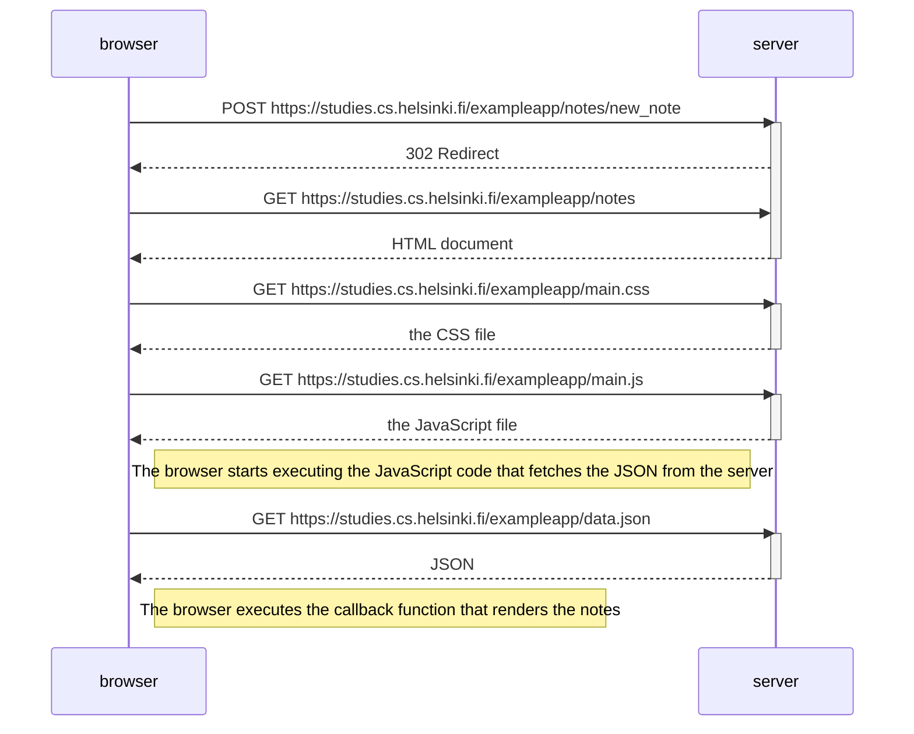

# New Note

The following diagram shows the situation when the user creates a new note on the [exampleapp](https://studies.cs/helsinki.fi/exampleapp/notes) by writing something into the text field and clicking the _Save_ button.

