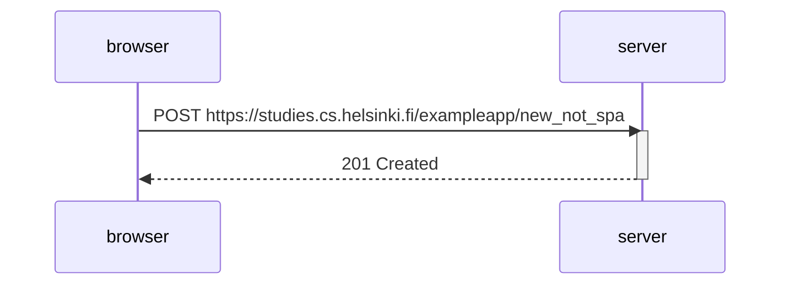

# New Note SPA

The following diagram shows the situation where the user creates a new note using the single-page version of the [app](https://studies.cs.helsinki.fi/example/spa).

```mermaid
sequenceDiagram
    participant browser
    participant server

    browser->>server: POST https://studies.cs.helsinki.fi/exampleapp/new_not_spa
    activate server
    server-->>browser: 201 Created
    deactivate server
```
